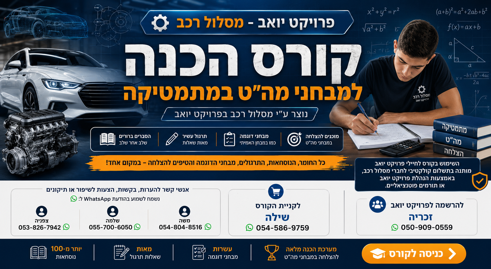
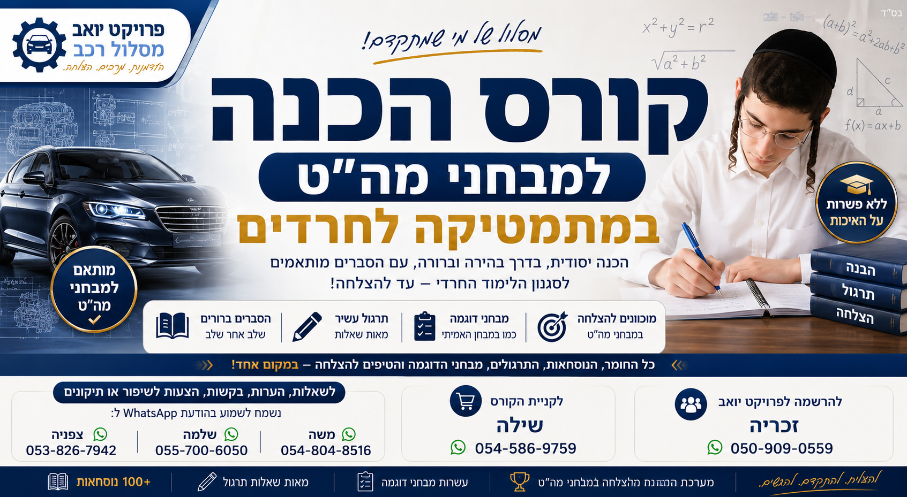
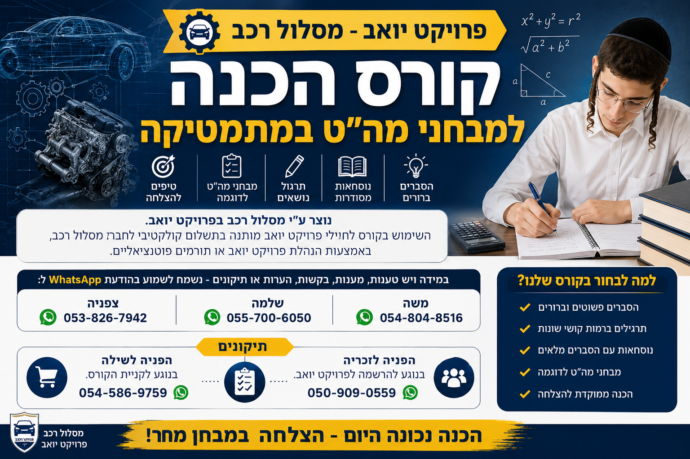

<div align="center">

# 📐 מתמטיקה לחרדים | Math for the Haredi Community

### פלטפורמת מתמטיקה מלאה לקהילה החרדית — הכנה למה"ט ולבגרות


[](https://math-haredim.netlify.app)

</div>

---

## 🎯 הבעיה → הפתרון

בקהילה החרדית אין מספיק חומרי לימוד איכותיים ונגישים למתמטיקה — לא לתלמידים שמתכוננים למה"ט, לא לבגרות 3 יחידות, ולא למבוגרים שרוצים ללמוד מחדש. **מתמטיקה לחרדים** היא פלטפורמה פתוחה וחינמית: 90+ שיעורים אינטראקטיביים, מחשבון מובנה, אנימציות GeoGebra, ועובדת גם ללא אינטרנט (PWA) — כדי שהלמידה תהיה זמינה לכל אחד, בכל מקום.

## 📸 Screenshots

<p align="center">
  
  
  
</p>

## ✨ מה בפרויקט

- 90+ שיעורים אינטראקטיביים בנושאי מתמטיקה
- אנימציות ו-GeoGebra משולבים בכל שיעור
- מבחנים דינמיים עם תיקון מיידי
- PWA — עובד גם ללא אינטרנט
- עיצוב RTL מלא בעברית
- מכסה: אלגברה, גיאומטריה, פונקציות, הסתברות ועוד

## 🛠️ טכנולוגיות

`HTML5` `CSS3` `JavaScript` `GeoGebra` `PWA` `Service Worker` `Netlify`

## 🌐 דמו חי

**[math-haredim.netlify.app](https://math-haredim.netlify.app)**

## 📦 הרצה מקומית

```bash
git clone https://github.com/DavidPatlas-AI/math-haredim
cd math-haredim
# פתח את index.html בדפדפן או השתמש ב-Live Server
```

**מבנה:**

```
├── index.html        # דף ראשי
├── landing.html      # דף נחיתה
├── topics/           # נושאי לימוד
├── learn/            # שיעורים אינטראקטיביים
├── calculator/       # מחשבון מובנה
├── shared/           # סגנונות ורכיבים משותפים
├── banners/          # גרפיקה
└── sw.js             # Service Worker
```

## 🤝 תרומה

Pull requests מתקבלים בברכה. לשיפור שיעורים, תיקון שגיאות או הוספת נושאים חדשים.

## 📄 רישיון

MIT © 2026 [David Patlas](https://github.com/DavidPatlas-AI)

---

*נבנה מתוך אהבה לקהילה. חינוך פתוח לכולם — בחינם.*
